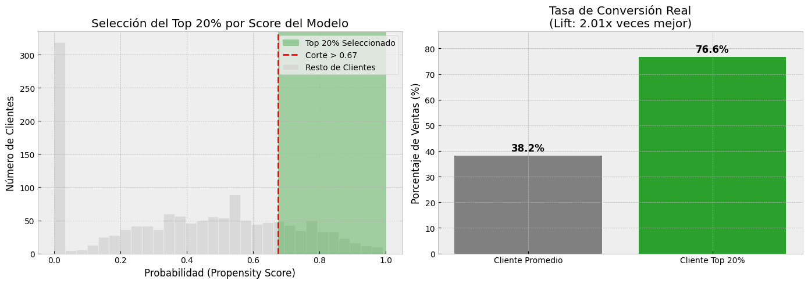
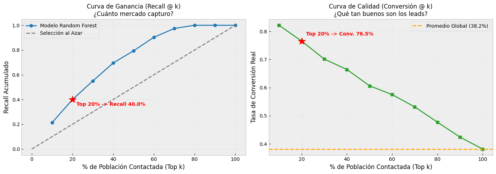
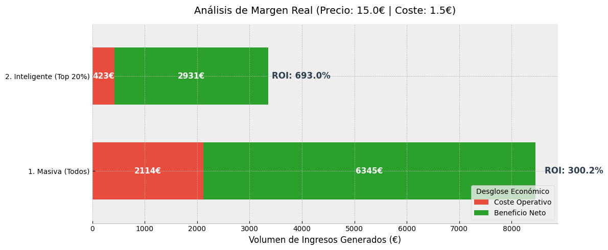
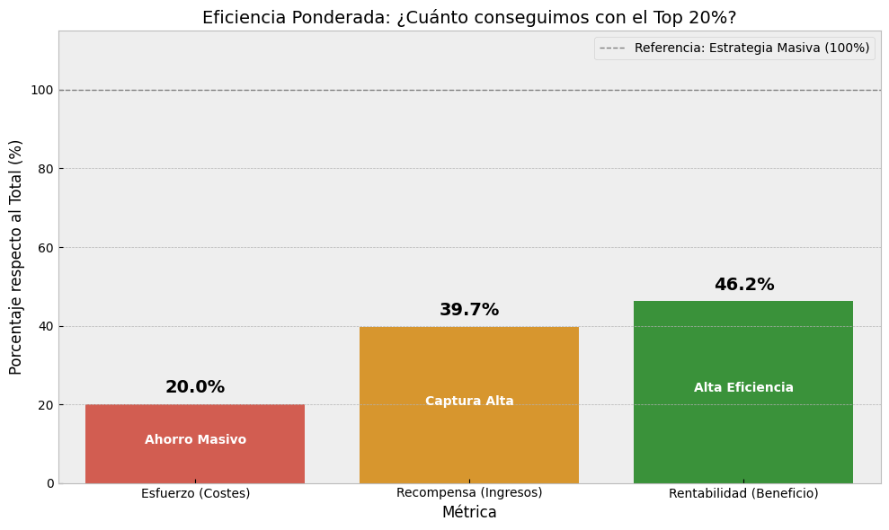
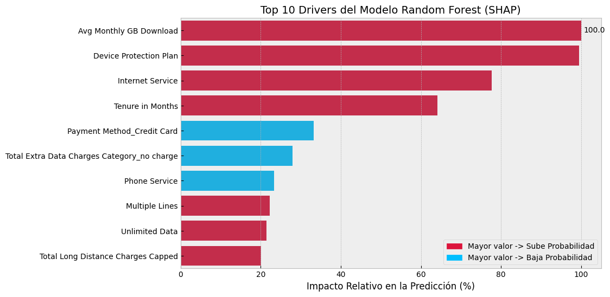
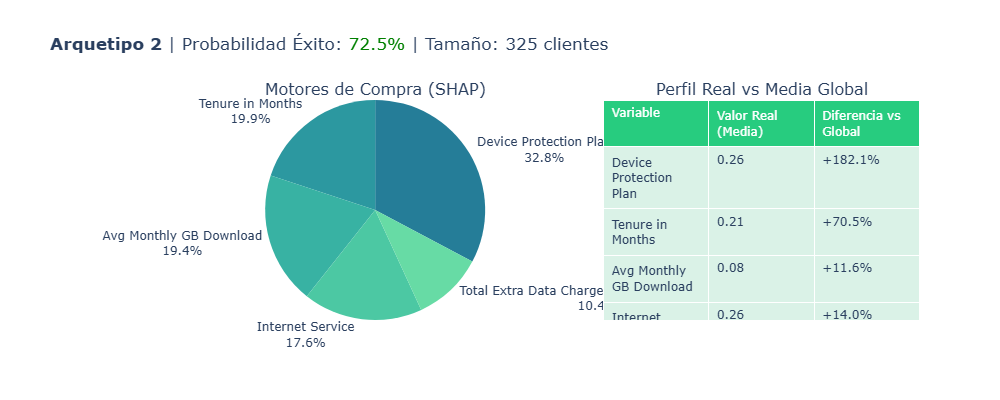
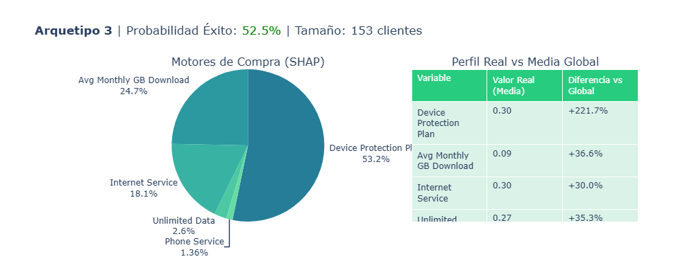
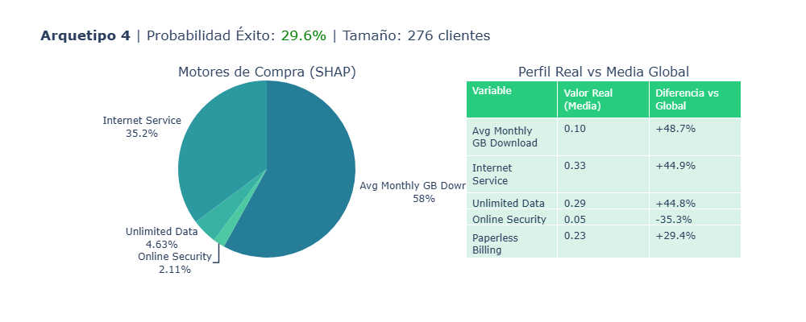
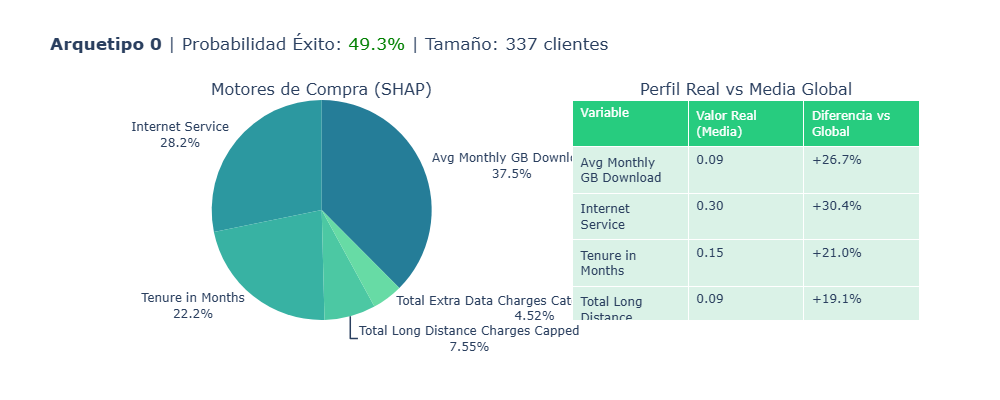
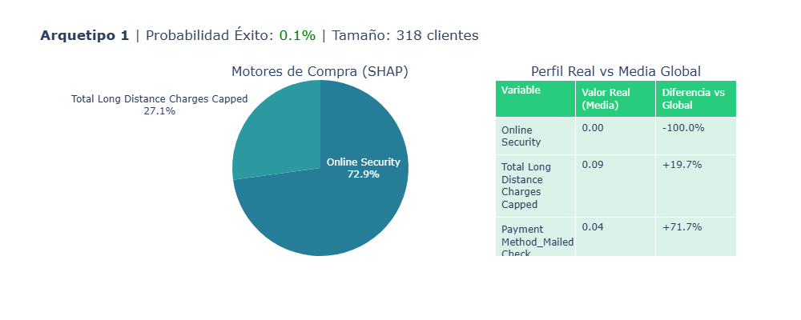

# Clasificación de leads con mayor probabilidad de compra
## 0. Introducción

TelcoNet opera en un mercado de telecomunicaciones altamente competitivo, donde la captación de nuevos clientes supone un coste cada vez mayor. En este contexto, el crecimiento mediante la venta de servicios adicionales a la base de clientes existente se ha convertido en un pilar estratégico para el aumento de ingresos.

Dentro del portfolio de servicios, los paquetes de *streaming* de películas han sido seleccionados como foco de este proyecto debido a su elevada demanda, atractivo margen de beneficio y su capacidad para mejorar la retención de clientes. No obstante, las campañas actuales se realizan de forma genérica, enviando ofertas de manera indiscriminada sin considerar el interés real de cada cliente. Esta aproximación deriva en bajas tasas de conversión, un uso ineficiente del presupuesto de marketing y una experiencia de cliente subóptima.

Con el objetivo de mejorar la eficiencia de las campañas y maximizar el retorno económico, TelcoNet busca identificar de forma precisa qué clientes tienen una mayor probabilidad de contratar este servicio, permitiendo diseñar acciones de marketing más focalizadas, relevantes y rentables.

## 1. Objetivos de negocio

El objetivo principal de este proyecto es maximizar el retorno de inversión (ROI) de las campañas de marketing de TelcoNet, focalizando los recursos comerciales exclusivamente en el Top 20% de clientes con mayor propensión a contratar el servicio de streaming de películas.

### Objetivos específicos

- Predecir la probabilidad de conversión de cada lead
  - Generar un propensity score individual entre 0 y 1.
  - Clasificar los clientes de mayor a menor probabilidad de contratación para obtener el top 20%.
  - Identificar a los clientes con mayor probabilidad de compra para maximizar ventas y eficiencia comercial, optimizando recursos y ajustando la estrategia según volumen y calidad.

- Cuantificar el impacto económico de las campañas
  - Estimar los ingresos potenciales de los leads con alta propensión: número de clientes × probabilidad de conversión × precio del servicio.
  - Ayudar a priorizar la inversión de marketing en los clientes más rentables.

- Identificar los factores que impulsan la contratación
  - Determinar qué variables (historial de consumo, perfil sociodemográfico, tipo de contrato, uso de otros servicios, antigüedad, etc.) influyen más en la propensión.
  - Proporcionar insights accionables para diseñar campañas más efectivas y personalizadas.

- Identificación de perfiles tipo por segmentos según la propensión de contratación
  - Analizar segmentos o grupos de clientes/leads con alta probabilidad de compra para identificar patrones comunes dentro de cada grupo.

## 2. Preguntas clave

Para lograr los objetivos planteados, TelcoNet busca desarrollar un modelo de clasificación de leads con mayor probabilidad de contratación del servicio de streaming de películas.  
Si el modelo funciona correctamente, permitirá que las campañas sean más eficientes, que los recursos de marketing se aprovechen mejor y que la experiencia de los clientes mejore, al recibir ofertas más relevantes y personalizadas. Además, se podrá estimar el impacto económico real de enfocar los esfuerzos en los clientes con mayor probabilidad de conversión.

### A partir de esta premisa, el modelo deberá responder a las siguientes cuestiones:

1. ¿Qué clientes tienen mayor probabilidad de contratar un servicio de streaming si se les ofrece?
   - Generar un propensity score entre 0 y 1 para cada lead.
   - Clasificar los clientes de mayor a menor probabilidad de contratación para obtener el top 20%.

2. ¿Qué ingresos potenciales se pueden generar al enfocarse en los leads de alta propensión?
   - Traducir los scores en ingresos estimados: número de clientes × probabilidad de conversión × precio del servicio.

3. ¿Qué características del cliente influyen más en la compra?
   - Aplicar técnicas de interpretabilidad como SHAP para identificar variables decisivas: tipo de contrato, uso de otros servicios, cargos mensuales, antigüedad, etc.

4. ¿Qué patrones comunes se observan en los segmentos de clientes con alta probabilidad de contratación?
   - Analizar segmentos o grupos de clientes/leads con alta probabilidad de compra para identificar patrones comunes dentro de cada grupo.

## 3. Preparación de los datos

El objetivo de este proyecto es predecir si un cliente contratará el servicio Streaming Movies, una variable binaria (sí/no; 1/0). Se trata, por tanto, de un problema de clasificación, ya que el interés no está en estimar un valor continuo, sino en anticipar una decisión concreta del cliente. Este enfoque permite identificar clientes con mayor probabilidad de contratar servicios adicionales, facilitando campañas de cross-selling o estrategias de personalización, optimizando el uso de recursos de marketing.

Para fines del análisis económico, se define un precio del servicio de streaming de 10$/mes, alineado con precios estándar del mercado para servicios complementarios de TV y contenidos bajo demanda.

Para el análisis se utiliza el dataset Telco Customer Churn, obtenido desde Hugging Face. El conjunto de datos contiene información de 7043 clientes y 52 variables sobre aspectos demográficos, contractuales, de uso de servicios y de facturación:

| Variable                          | Descripción                                                | Tipo de variable   |
| --------------------------------- | ---------------------------------------------------------- | ----------------- |
| Age                               | Edad del cliente en años                                   | Numérica discreta  |
| Avg Monthly GB Download           | Promedio mensual de GB descargados                         | Numérica discreta  |
| Avg Monthly Long Distance Charges | Cargo mensual medio por llamadas de larga distancia        | Numérica continua  |
| Churn Category                    | Categoría general del motivo de churn                      | Categórica nominal |
| Churn Reason                      | Motivo específico del churn                                | Categórica nominal |
| Churn Score                       | Score (0–100) que indica la probabilidad de churn          | Numérica discreta |
| City                              | Ciudad de residencia del cliente                           | Categórica nominal |
| CLTV                              | Customer Lifetime Value                                    | Numérica discreta |
| Contract                          | Tipo de contrato del cliente                               | Categórica nominal |
| Country                           | País de residencia del cliente                             | Categórica nominal |
| Customer ID                       | Identificador único del cliente                            | Identificador      |
| Customer Status                   | Estado final del cliente (Stayed, Churned, Joined)         | Categórica nominal |
| Dependents                        | Indica si el cliente tiene dependientes (0/1)              | Binaria            |
| Device Protection Plan            | Indica si tiene plan de protección de dispositivos (0/1)   | Binaria            |
| Gender                            | Género del cliente                                         | Categórica nominal |
| Internet Service                  | Indica si dispone de servicio de internet (0/1)            | Binaria            |
| Internet Type                     | Tipo de conexión a internet                                | Categórica nominal |
| Lat Long                          | Coordenadas latitud-longitud combinadas                    | Geográfica / texto |
| Latitude                          | Latitud de la residencia                                   | Numérica continua  |
| Longitude                         | Longitud de la residencia                                  | Numérica continua  |
| Married                           | Indica si el cliente está casado (0/1)                     | Binaria            |
| Monthly Charge                    | Cargo mensual total del cliente                            | Numérica continua  |
| Multiple Lines                    | Indica si tiene múltiples líneas telefónicas (0/1)         | Binaria            |
| Number of Dependents              | Número de dependientes del cliente                         | Numérica discreta  |
| Number of Referrals               | Número de referencias realizadas                           | Numérica discreta  |
| Offer                             | Última oferta comercial aceptada                           | Categórica nominal |
| Online Backup                     | Servicio de copia de seguridad online (0/1)                | Binaria            |
| Online Security                   | Servicio de seguridad online (0/1)                         | Binaria            |
| Paperless Billing                 | Facturación electrónica (0/1)                              | Binaria            |
| Partner                           | Indica si tiene pareja (0/1)                               | Binaria            |
| Payment Method                    | Método de pago                                             | Categórica nominal |
| Phone Service                     | Indica si tiene servicio telefónico (0/1)                  | Binaria            |
| Population                        | Población estimada del código postal                       | Numérica discreta  |
| Premium Tech Support              | Soporte técnico premium (0/1)                              | Binaria            |
| Quarter                           | Trimestre fiscal                                           | Categórica ordinal |
| Referred a Friend                 | Indica si ha referido a un amigo (0/1)                     | Binaria            |
| Satisfaction Score                | Puntuación de satisfacción del cliente                     | Numérica discreta  |
| Senior Citizen                    | Indica si es adulto mayor (0/1)                            | Binaria            |
| State                             | Estado de residencia                                       | Categórica nominal |
| Streaming Movies                  | Servicio de streaming de películas (0/1)                   | Binaria            |
| Streaming Music                   | Servicio de streaming de música (0/1)                      | Binaria            |
| Streaming TV                      | Servicio de streaming de TV (0/1)                          | Binaria            |
| Tenure in Months                  | Antigüedad del cliente en meses                            | Numérica discreta  |
| Total Charges                     | Total acumulado facturado                                  | Numérica continua  |
| Total Extra Data Charges          | Cargos totales por datos extra                             | Numérica discreta  |
| Total Long Distance Charges       | Total cargos por larga distancia                           | Numérica continua  |
| Total Refunds                     | Total de reembolsos recibidos                              | Numérica continua  |
| Total Revenue                     | Ingresos totales generados por el cliente                  | Numérica continua  |
| Under 30                          | Indica si el cliente es menor de 30 años (0/1)             | Binaria            |
| Unlimited Data                    | Indica si tiene datos ilimitados (0/1)                     | Binaria            |
| Zip Code                          | Código postal de residencia                                | Categórica ordinal |
| Churn                             | Variable objetivo: indica si el cliente ha churneado (0/1) | Binaria (target)   |

---

### Exploración y análisis inicial

Durante la fase de exploración, se detectaron patrones importantes, ciertas variables tenían valores extremadamente altos en pocos clientes (colas largas), mientras que otras mostraban una gran cantidad de ceros o categorías poco frecuentes. Para que los modelos aprendan patrones generales sin verse sesgados por casos atípicos, se aplicaron transformaciones específicas:

| Variable                   | Motivo                             | Transformación                       |
|----------------------------|-----------------------------------|-------------------------------------|
| Number of Dependents       | Distribución concentrada en valores bajos y algunos extremos | Agrupación (0-3, 4-6, 7+)          |
| Number of Referrals        | Muchos ceros y pocos valores altos | Agrupación (0,1,2+) |
| Total Charges              | Algunos clientes con valores muy altos | Log + Escalado                       |
| Total Extra Data Charges   | Gran parte sin cargos y algunos muy altos | Discretización (no charge / Less / High) |
| Total Long Distance Charges| Valores extremos que distorsionan la distribución | Capping + Log                        |
| Total Revenue              | Valores extremos que podrían dominar el modelo | Capping + Log     |

En paralelo, se eliminan variables sin capacidad predictiva, redundantes o que podrían introducir data leakage:

- Identificadores únicos o de ubicación sin variabilidad significativa: Customer ID, Country, State, City, Latitude, Longitude, Lat Long, Zip Code, Population.
- Variables derivadas del churn: Churn Category, Churn Reason, Churn Score.
- Variables históricas o muy agregadas que podrían sesgar el modelo: Offer, Total Charges, Total Extra Data Charges, Total Long Distance Charges, Total Revenue.
- Variables redundantes con otras existentes: Age y Senior Citizen se reemplazan por Under 30; Partner es redundante con Married; Number of Dependents y Number of Referrals se reemplazan por sus versiones agrupadas.
- Variables con baja variabilidad: Total Refunds, Internet Type.

Estas decisiones permiten que el dataset final contenga solo variables informativas y relevantes para la predicción, evitando ruido que podría reducir el rendimiento del modelo.

### Codificación de variables

Las variables categóricas multiclase (Contract, Customer Status, Gender, Payment Method o Number Dependents Grouped, Referrals Grouped, Total Extra Data Charges Category) se codificaron mediante One-Hot Encoding, generando columnas binarias independientes para cada categoría. Esto evita que el modelo interprete un orden inexistente entre categorías. Las variables originalmente binarias se mantuvieron como 0/1. El resto, sufrieron la siguiente transformación:

| Variable                                    | Valor  | Variable original                 |
| ------------------------------------------- | ------ | --------------------------------- |
| contract_One Year                           | (0, 1) | Contract                          |
| contract_Two Year                           | (0, 1) | Contract                          |
| customer_status_Churned                     | (0, 1) | Customer Status                   |
| customer_status_Joined                      | (0, 1) | Customer Status                   |
| gender_Male                                 | (0, 1) | Gender                            |
| payment_method_Credit Card                  | (0, 1) | Payment Method                    |
| payment_method_Mailed Check                 | (0, 1) | Payment Method                    |
| number_dependents_grouped_0                 | (0, 1) | Number Dependents Grouped         |
| number_dependents_grouped_1-2               | (0, 1) | Number Dependents Grouped         |
| number_dependents_grouped_3-4               | (0, 1) | Number Dependents Grouped         |
| number_dependents_grouped_5+                | (0, 1) | Number Dependents Grouped         |
| referrals_grouped_0                         | (0, 1) | Referrals Grouped                 |
| referrals_grouped_1                         | (0, 1) | Referrals Grouped                 |
| referrals_grouped_2+                        | (0, 1) | Referrals Grouped                 |
| total_extra_data_charges_category_no charge | (0, 1) | Total Extra Data Charges Category |
| total_extra_data_charges_category_Less      | (0, 1) | Total Extra Data Charges Category |
| total_extra_data_charges_category_High      | (0, 1) | Total Extra Data Charges Category |

Para evitar multicolinealidad, se eliminaron variables con correlación superior al 90%, como Total Charges Log, Married, Total Revenue Log y Referred a Friend. Además, se revisó la correlación con el target (Streaming Movies), identificando que Streaming TV estaba fuertemente correlacionada (r ≈ 0.88) y actuaba como una proxy directa; por ello se eliminó para evitar sesgos en el modelo, dejando un dataset limpio y confiable.

### Separación de datos

Luego, dividimos los datos en 80% para entrenamiento y 20% para prueba, asegurando que el modelo aprendiera lo suficiente pero pudiera demostrar su capacidad de generalización en datos no vistos. Como los resultados debían ser comparables, fijamos un random_state, de modo que cada ejecución del notebook produjera la misma división, facilitando la comparación de resultados y la depuración.

### Balanceo de clases

Al revisar la variable objetivo, vimos un desequilibrio: la mayoría de los clientes no contrataba Streaming Movies (61%), mientras que solo el 39% sí. Para que el modelo aprendiera de manera justa, aplicamos oversampling a la clase minoritaria, sin sacrificar información de la clase mayoritaria.

### Escalado

Para que ninguna variable domine por su escala, aplicamos MinMaxScaler, llevando todos los valores al rango 0–1. 

### Normalización

Se aplicó normalización para ajustar la distribución de las variables y mejorar la estabilidad y el rendimiento del modelo. Este paso es importante porque muchas técnicas de machine learning, especialmente aquellas basadas en distancias o gradientes, funcionan mejor cuando las variables tienen media cero y desviación estándar uniforme, evitando que algunas variables dominen el aprendizaje por tener rangos más amplios o distribuciones sesgadas.

- Para los datos de entrenamiento se utilizó la versión oversampled, de manera que la normalización reflejara la distribución balanceada de las clases.  
- Para el conjunto de prueba se empleó la versión original escalada, asegurando que los datos de evaluación mantuvieran su distribución real y que las métricas de desempeño reflejaran el comportamiento del modelo en condiciones auténticas.

### Feature Selection

Con el fin de reducir la complejidad y el ruido sin perder la interpretabilidad del modelo, se aplicó SelectKBest identificando las 20 más relevantes para el target. 

Con todas las transformaciones y ajustes aplicados, el dataset queda listo para el modelado, ofreciendo datos limpio y consistentes.

## 4. Modelado

Durante el modelado se evaluaron distintos algoritmos de clasificación, desde modelos simples hasta técnicas avanzadas de Machine Learning, incluyendo Regresión Logística, Naive Bayes, K-Nearest Neighbours, Decision Tree, Stochastic Gradient Descent, Support Vector Machine, Random Forest y Gradient Boosting.

Se selecciona Random Forest como modelo final, ya que, aunque la Regresión Logística ofrece un buen AUC (0,845), Random Forest supera a todos los modelos en F1-Score (0,712) y Accuracy (0,746), mostrando el mejor equilibrio entre precisión y cobertura.

El factor decisivo para el negocio es su recall superior (82,3%), frente al 74,1% de Gradient Boosting, lo que significa que Random Forest identifica significativamente más oportunidades de compra reales y minimiza el riesgo de dejar pasar clientes interesados. Además, su capacidad para modelar relaciones no lineales y mantener alta sensibilidad lo convierte en la herramienta más rentable para maximizar la captación de la campaña. Por último, permite extraer la importancia de variables, proporcionando al equipo de marketing una jerarquía clara de los factores que impulsan la compra, clave para diseñar campañas personalizadas y fundamentar decisiones estratégicas.

Para evaluar la efectividad de los diferentes modelos, se preparó una función de evaluación que calcula varias métricas clave: accuracy, precision, recall, f1_score y AUC. Estas métricas se eligieron porque permiten analizar el desempeño desde diferentes perspectivas en problemas de clasificación como este:

- **Accuracy (Exactitud):** Indica el porcentaje de predicciones correctas sobre el total. Es útil como medida general, pero puede ser engañosa si hay clases desbalanceadas.

- **Precision (Precisión):** Mide la proporción de predicciones positivas correctas sobre todas las predicciones positivas. Es importante cuando el costo de falsos positivos es alto.

- **Recall (Sensibilidad):** Evalúa qué proporción de casos positivos reales fueron correctamente identificados por el modelo. Es crucial cuando no queremos dejar pasar casos relevantes.

- **F1 Score:** Combina precision y recall en una sola métrica balanceada, especialmente útil cuando hay un trade-off entre ambos y en datasets desbalanceados.

- **AUC (Área bajo la curva ROC):** Evalúa la capacidad del modelo para distinguir entre clases en distintos umbrales de decisión, proporcionando una visión global de su discriminación.

Con esta función, podemos comparar modelos de forma objetiva, entendiendo no solo cuántos aciertos tienen, sino también cómo manejan los errores y su capacidad para separar correctamente las clases, lo que es crítico en problemas de clasificación.

## 5. Evaluación

La fase de Evaluación es el momento de comprobar si el modelo realmente aporta valor al negocio. Aquí se analizan sus resultados, se entiende cómo y por qué toma decisiones y se evalúa su impacto real, determinando si está preparado para ser utilizado o si necesita ajustes antes de su puesta en producción.

Durante la fase de interpretabilidad (SHAP & Feature Importance), identificamos y mitigamos dos riesgos críticos para la validez del modelo:

- **Eliminación de Variables Financieras:** Detectamos que Monthly Charge y Total Revenue actuaban como predictores artificialmente perfectos (Target Leakage). Dado que el coste del servicio de Streaming Movies ya estaba implícito en la factura, el modelo "deducía" el precio en lugar de predecir la propensión de compra.

- **Exclusión de Streaming Music:** Se decidió eliminar esta variable debido a su peso desproporcionado, que eclipsaba otros patrones relevantes. Al retirarla, forzamos al algoritmo a aprender patrones de comportamiento e infraestructura reales (como la necesidad de datos ilimitados o la intensidad de descarga), garantizando un modelo robusto y útil para la captación de nuevos clientes en frío, no solo para venta cruzada.

### Predicción de la probabilidad de conversión de cada lead

Se ha identificado el Top 20% de clientes con mayor probabilidad de compra, estos tienen una probabilidad superior al 67%. Al enfocar los esfuerzos comerciales en este grupo, la tasa de conversión se dispara, pasando del 38,2% que se obtendría contactando clientes al azar, al 76,6% al trabajar solo con el Top 20%.

El modelo permite captar el 40% de las ventas potenciales contactando solo al Top 20% de clientes, en lugar del 40% de la población que sería necesario contactar de forma aleatoria. Además, en este Top 20% la tasa de conversión alcanza el 76,5%, muy por encima del promedio del 38,2%. Esto demuestra que el modelo no solo prioriza con precisión a los clientes más propensos a comprar, sino que también permite ajustar la estrategia según los recursos disponibles, combinando eficiencia y volumen de manera flexible.

### Impacto económico

La estrategia masiva implica un coste elevado (2.114€) en llamadas poco efectivas y, aunque genera ingresos, su eficiencia es limitada (ROI 300%). En contraste, la estrategia inteligente enfocada en el Top 20% de clientes reduce el gasto a solo 423€, utilizando solo el 20% del presupuesto total, y alcanza un ROI del 693%, más del doble de eficiente.

A pesar del menor gasto, esta estrategia captura el 39,7% de la facturación total, casi la mitad de los ingresos posibles, demostrando que se puede obtener gran parte del resultado con una fracción del esfuerzo.

Por tanto, el Top 20% combina eficiencia y rentabilidad, permitiendo maximizar los ingresos mientras se minimizan los costes operativos.

### Características del cliente que influyen en la contratación

Gracias al análisis de la explicabilidad mediante SHAP, tanto a nivel global como local, es posible identificar qué perfiles de clientes presentan mayor propensión a la contratación del servicio y comprender los factores que influyen en esta decisión. Estos resultados son coherentes con los obtenidos a través de Feature Importance del modelo y se refuerzan con el análisis local mediante LIME, lo que aporta mayor solidez a la interpretación.

El modelo se apoya principalmente en el uso efectivo del servicio, siendo el consumo medio mensual de datos (Avg Monthly GB Download) el factor más determinante, junto con la disponibilidad de infraestructura de internet (Internet Service). Esto confirma que la actividad digital real es la base de la probabilidad de contratación.

También influyen positivamente otros factores como la contratación de servicios adicionales (Device Protection Plan), la existencia de planes más completos (Unlimited Data, Multiple Lines) y la antigüedad en la compañía (Tenure in Months), lo que caracteriza a clientes más integrados y con mayor valor potencial.

En cambio, el modelo penaliza perfiles con baja actividad digital, sin acceso a internet o con un uso muy limitado de los servicios, incluso cuando presentan una relación prolongada con la empresa. Además, se observan factores específicos que reducen la propensión, como el pago con tarjeta de crédito (Payment Method_Credit Card) y la ausencia de cargos extra por datos (Total Extra Data Charges – no charge), asociados a un comportamiento de consumo más pasivo.

Desde una perspectiva operativa, estos patrones se traducen en insights directamente accionables: las campañas comerciales pueden enfocarse en clientes activos, con alto consumo, servicios complementarios y contratos consolidados, mientras que los perfiles pasivos o con señales de bajo uso pueden excluirse de acciones comerciales poco eficientes. De este modo, la interpretabilidad del modelo no solo aporta transparencia, sino que facilita el diseño de campañas más efectivas y personalizadas, alineadas con el comportamiento real de los clientes.

### Segmentos de cliente según la probabilidad de contratación

Mediante el clustering de los valores SHAP, aplicando así una explicabilidad agrupada, hemos podido detectar los patrones claros entre los segmentos de clientes con diferente probabilidad de contratar el servicio de streaming:

- **Cliente veterano con alta protección – Probabilidad 72,5%:** Se caracteriza por una antigüedad elevada, una fuerte contratación de servicios de protección (Device Protection Plan) y un alto gasto en GB de datos (Avg Monthly GB Download). Son clientes fidelizados y predispuestos a adquirir servicios adicionales.

---

- **Cliente reciente con alta protección – Probabilidad 52,5%:** Aunque son clientes nuevos, muestran alta contratación de protección (Device Protection Plan) y consumo de datos relevante (Avg Monthly GB Download), lo que refleja interés en maximizar el uso de sus dispositivos.

---

- **Cliente intensivo de datos – Probabilidad 29,6%:** Perfil de consumo muy elevado de datos (Avg Monthly GB Download) y presencia de planes ilimitados (Unlimited Data), aunque con menor interés en servicios de seguridad digital (Online Security).

---

- **Cliente digital equilibrado – Probabilidad 49,3%:** Presenta valores medios-altos en consumo de datos (Avg Monthly GB Download), internet (Internet Service) y antigüedad (Tenure in Months); estable, con buena base digital y sin barreras claras para contratar.

---

- **Cliente con baja digitalización – Probabilidad 0,1%:** Ausencia de servicios digitales y métodos de pago tradicionales, mostrando bajo interés y condiciones técnicas insuficientes para contratar.

Los segmentos con mayor fidelización y contratación de servicios de valor añadido presentan patrones consistentes de alta propensión, mientras que los menos digitalizados muestran claramente menor interés. Estos insights permiten diferenciar estrategias y enfocar recursos en los leads con mayor potencial, adaptando acciones según los patrones comunes de cada grupo.

## 6. DESPLIEGUE

Una vez validado el modelo, este queda preparado para su implementación en el entorno de producción, permitiendo su uso continuo por parte de los equipos de negocio. El objetivo del despliegue es garantizar que el modelo sea accesible, reproducible y monitorizable, asegurando su correcta integración en los procesos comerciales y su sostenibilidad en el tiempo.

### Estrategia de ejecución del modelo

Dado el contexto del proyecto, el modelo se desplegaría como un proceso batch con ejecución semanal. Esta periodicidad resulta adecuada para campañas comerciales, ya que no se requieren predicciones en tiempo real y permite recalcular de forma eficiente los propensity scores de toda la base de clientes.

El flujo de ejecución consistiría en la extracción automática de datos desde la base de datos corporativa, su preprocesamiento, la ejecución del modelo y la generación de un dataset final con los clientes priorizados. Los resultados se pondrían a disposición del negocio a través de dashboards interactivos y alertas automáticas dirigidas a los responsables comerciales.

### Arquitectura y herramientas de despliegue

El modelo se encapsularía en un contenedor Docker, garantizando la independencia del entorno y la reproducibilidad del proceso. Este contenedor formaría parte de un pipeline automatizado encargado de:

- Obtener los datos actualizados.
- Aplicar las transformaciones necesarias.
- Ejecutar el modelo.
- Generar salidas consumibles por el negocio, como informes, rankings o visualizaciones.

El acceso a los resultados se realizaría exclusivamente a través de dashboards y reportes automatizados, sin necesidad de que los usuarios finales interactúen directamente con el modelo.

### Reentrenamiento, actualización y versionado del modelo

El modelo se reentrenaría de forma trimestral o cuando se detectaran señales de degradación, como cambios significativos en el comportamiento de los clientes, pérdida de rendimiento en métricas clave o la incorporación de nuevas variables relevantes.

En caso de descubrir nuevas features o implementar mejoras en el modelo, estas se desarrollarían y validarían previamente en un entorno de pruebas. Cada actualización daría lugar a una nueva versión del modelo, manteniendo las versiones anteriores para asegurar trazabilidad, facilitar comparaciones y permitir un posible rollback. Este enfoque de versionado permite evolucionar el modelo de forma controlada y alineada con los cambios del entorno y del negocio.

### Monitorización y detección de data drift

El rendimiento del modelo se monitorizaría mediante métricas técnicas y de negocio, como tasa de conversión, lift y estabilidad de los propensity scores. Adicionalmente, se analizarían cambios en la distribución de las variables de entrada para detectar posibles situaciones de data drift, lo que permitiría anticipar degradaciones del modelo y activar procesos de revisión o reentrenamiento.

### Documentación y adopción por el negocio

Finalmente, se proporcionaría documentación clara sobre el funcionamiento del modelo, sus supuestos y limitaciones, así como formación a los usuarios finales. Esto asegura que el modelo no solo esté correctamente desplegado desde un punto de vista técnico, sino que sea comprendido, utilizado y explotado de manera efectiva por el negocio.

## 7. CONCLUSIONES

El Modelo de Propensión de Contratación ha logrado transformar la captación masiva en una estrategia proactiva y eficiente, identificando clientes con alta probabilidad de contratar servicios de streaming.

Mediante el modelo de Machine Learning del Random Forest, ha sido capaz de detectar relaciones complejas y no lineales, con una sensibilidad sobresaliente (Recall 82,3%), pudiendo explicar qué clientes son más leales, cuáles consumen más, qué tipo de contrato prefieren, y cómo estas variables se combinan para predecir la contratación.

Desde la perspectiva del negocio, al enfocarnos en el Top 20% de clientes, conseguimos capturar casi la mitad de los ingresos potenciales con apenas una quinta parte del esfuerzo, elevando el ROI del 300% al 693%. 

Gracias a SHAP y LIME, hemos podido entender qué factores influyen en la contratación y diferenciar segmentos de clientes. Por ejemplo, los clientes con alta antigüedad, un consumo mensual elevado de datos y la contratación de servicios adicionales como Device Protection Plan muestran la mayor propensión a contratar, lo que permite al equipo comercial priorizar estos perfiles y diseñar mensajes personalizados, mientras que los clientes con baja actividad digital o sin acceso a internet pueden enfocarse en estrategias de menor coste.

Finalmente, la monitorización constante garantiza que el modelo siga siendo confiable. Métricas técnicas y de negocio, combinadas con la detección de data drift, permiten anticipar cambios en el comportamiento de los clientes y mantener la eficiencia de la estrategia a lo largo del tiempo.

### Posibles mejoras

Con más tiempo y recursos, el proyecto podría evolucionar hacia un sistema predictivo más inteligente y ágil. Por ejemplo, el modelo podría actualizarse en tiempo real, de manera que cada interacción del cliente —una visita a la web, apertura de un email, o interacción con la app— ajuste inmediatamente su propensity score y alimente automáticamente el CRM para activar acciones comerciales personalizadas.

La integración de datos externos como información socioeconómica por código postal, tendencias de mercado, historial de compras en otras categorías o comportamientos en redes sociales, junto con datos digitales detallados como clics, visitas, tiempo de permanencia en la web y apertura de campañas previas, permitiría construir perfiles de cliente mucho más precisos y segmentados.

Los experimentos controlados (A/B testing) combinados con dashboards interactivos en Power BI permitirían medir el impacto de distintas estrategias: por ejemplo, comparar la respuesta de clientes contactados por llamada frente a email, analizar la conversión por segmento o visualizar el efecto de promociones específicas. Los dashboards podrían incluir métricas clave como tasa de conversión, lift, ingresos generados por segmento, coste por contacto y comportamiento temporal de clientes, ofreciendo a Marketing una visión clara y accionable.

En conjunto, estas mejoras convertirían la inteligencia predictiva en un aliado estratégico, no solo optimizando quién contactar, sino cómo, cuándo y con qué impacto económico, maximizando la eficiencia comercial y el retorno de la inversión.

